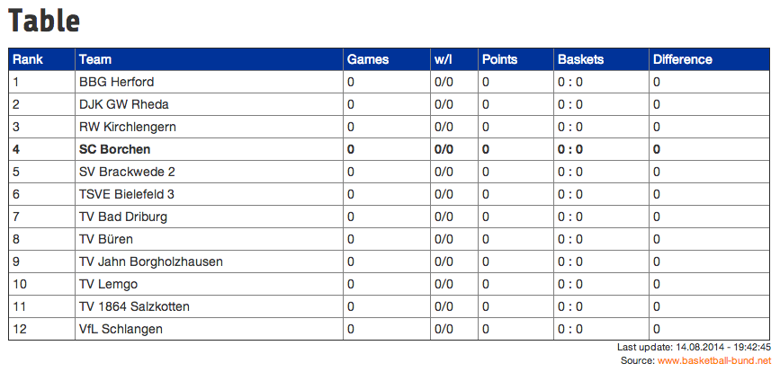
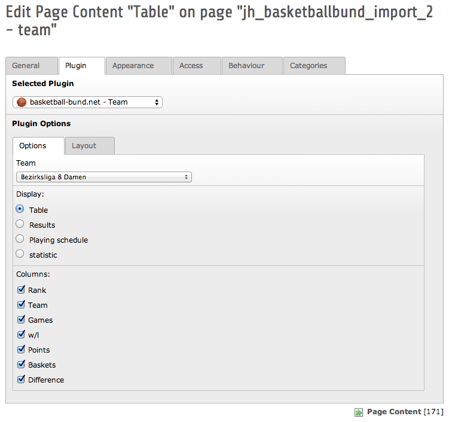

.. ==================================================
.. FOR YOUR INFORMATION
.. --------------------------------------------------
.. -*- coding: utf-8 -*- with BOM.

.. include:: ../Includes.txt

.. _introduction:

Introduction
============

.. _what-it-does:

What does it do?
----------------

basketball-bund.net provides tables, resulds, playing schedules and statistics for every league. But by default there is no way to display these data at your own website.

This extension tries to provide a solution, and imports the requested data to your TYPO3 CMS.

The first plugin "basketball-bund.net - Team" just imports the selected data (table, results, playing schedule or statistics) and displays them as configurable table.

The seconde plugin "basketball-bund.net - Teamcollection" fetches the last match-result of the teams in the collection an displays them in only one table. Ideal as an overview at your startpage.

.. _screenshots-team:

Screenshots Team
----------------

   Table of a league with stressed team

   The configuration of the table in Backend

.. _screenshots-teamcollection:

Screenshots Teamcollection
--------------------------

.. note::
	| While developing and writing the documentation, there has been no meaningful data due to the summer-break.
	| A screenshot of the Teamcollection will be available soon.
	| Please check for extension-updates.

.. figure:: ../Images/Introduction/Teamcollection_fe_001.png
   :width: 500px
   :alt: Teamcollection in Frontend

   Teamcollection in Frontend

.. figure:: ../Images/Introduction/Teamcollection_be_001.png
   :width: 500px
   :alt: Teamcollection in Backend

   The configuration of the teamcollection-table in Backend